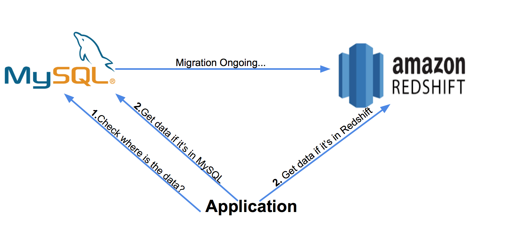

# Data Migrator

Project Presentation: https://docs.google.com/presentation/d/1he1XExo9ja1tQ1pNQqU4zMbWFc2VrPvduFJTBZC09mw/edit#slide=id.p1
Project Demo: https://youtu.be/PMcB69KmHNc
## Introduction

The project is simulating the database migration process from MySQL to Amazon Redshift. The dataset used is the common crawl data from Amazon public data set, for more information about the dataset, please go to http://commoncrawl.org

## Approach

The project is simulating an application trying to access some data inside the database.
1. It will query the status table in MySQL to find out the status of the certain data
2. The application will retrieve the data according to the return result from MySQL




## The outline of the data pipeline


## Directory Map

    ├── README.md 
    ├── src
    │   └── parse_to_sql.py
    │   └── migrate_to_redshift.py
    ├── img
    │   └── prepare.jpg
    │   └── migration.jpg
    │   └── approach.jpg
    ├── Flask
        └── run.py
        └── tornadoapp.py
        └── app
            └── __init__.py
            └── views.py
            └── static
            └── templates

## Setup

1.create a mysql databse

2.create a Amazon Redshift Cluster

3.install spark

4.parse the data into mysql using the below command:
```
/home/ubuntu/.local/bin/spark-submit --jars /usr/local/spark/mysql-java.jar parse_to_sql.py
```

5.migrate the data from mysql to Amazon Redshift using below command:
```
/home/ubuntu/.local/bin/spark-submit --jars /usr/local/spark/mysql-java.jar,/home/ubuntu/RedshiftJDBC42-1.2.15.1025.jar --packages com.databricks:spark-avro_2.11:4.0.0,com.databricks:spark-redshift_2.10:3.0.0-preview1 migrate_to_redshift.py
```

6. Run the UI
```
sudo -E python tornadoapp.py
```
