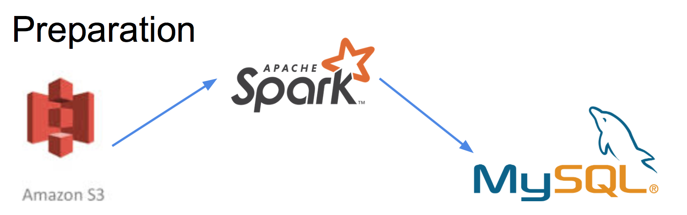
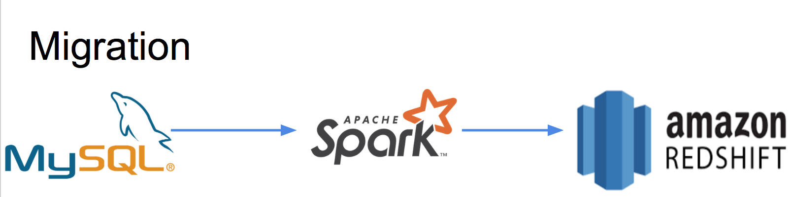

# Data Migrator

================

## Introduction

The project is simulating the database migration process from MySQL to Amazon Redshift. The dataset used is the common crawl data from Amazon public data set, for more information about the dataset, please go to http://commoncrawl.org


## The outline of the data pipeline





## Directory Map

app: All the code,html template and css for the Flask GUI

parse_to_sql.py : The pyspark code parse all the data from common crawl dataset in s3 to MySQL databse

migrate_to_redshift.py : The pyspark code to take the data from MySQL, denormalized it and then insert into Amazon Redshift

tornadoapp.py : Allow multiple user access the web server

run.py : execute file for Flask GUI

## Setup

1.create a mysql databse

2.create a Amazon Redshift Cluster

3.install spark

4.parse the data into mysql using the below command:
```
/home/ubuntu/.local/bin/spark-submit --jars /usr/local/spark/mysql-java.jar parse_to_sql.py
```

5.migrate the data from mysql to Amazon Redshift using below command:
```
/home/ubuntu/.local/bin/spark-submit --jars /usr/local/spark/mysql-java.jar,/home/ubuntu/RedshiftJDBC42-1.2.15.1025.jar --packages com.databricks:spark-avro_2.11:4.0.0,com.databricks:spark-redshift_2.10:3.0.0-preview1 migrate_to_redshift.py
```

6. Run the UI
```
sudo -E python tornadoapp.py
```
